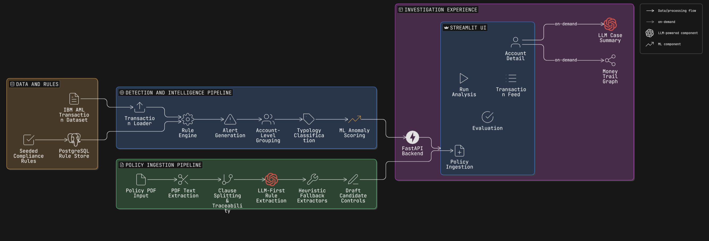
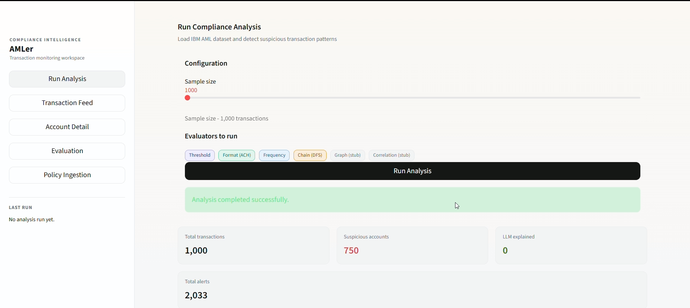
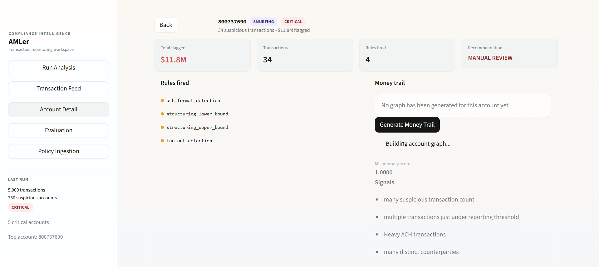
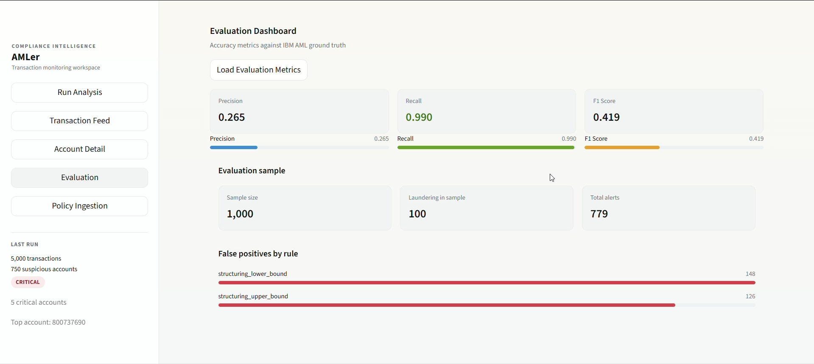
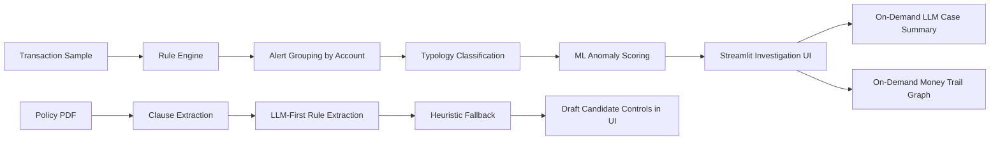

# AMLer

AMLer is a hybrid Anti-Money Laundering investigation system I built around a simple idea: AML tools should not just flag suspicious transactions, they should help an analyst understand why an account looks risky, what laundering pattern it resembles, and what to investigate next.

It combines:

- rule-based detection
- account-level typology classification
- Isolation Forest prioritization
- on-demand LLM case summaries
- policy PDF ingestion into draft candidate controls
- graph-based money trail visualization

At a high level, AMLer uses rules to detect suspicious activity, typology logic to interpret it, ML to prioritize it, and LLMs to explain it.

## Live Demo

- UI: [AMLer UI](https://huggingface.co/spaces/rahulT-17/AMLer-ui)
- API: [AMLer API](https://huggingface.co/spaces/rahulT-17/AMLer-api)

The public deployment runs with `LLM_ENABLED=false`, so the hosted demo focuses on the core investigation flow, ML prioritization, graph generation, evaluation dashboard, and heuristic policy-ingestion path without depending on a live model endpoint.

## High-Level Architecture



_High-level flow of the investigation and policy-ingestion paths._


## Why I Built It

Most AML demos stop at one layer:

- a rules engine
- a classifier
- a dashboard
- an LLM summary

I wanted to build a system where each layer had a clear job:

- rules for detection
- typology for interpretation
- ML for prioritization
- LLM for explanation
- policy ingestion for candidate-control generation

That separation of responsibilities is the main architectural idea behind AMLer.

## Dockerized Local Stack

AMLer now runs locally as a Docker Compose stack with:

- FastAPI backend
- Streamlit UI
- PostgreSQL database

This made the project much easier to demo and much closer to a realistic full-stack workflow.

## Screens

### Investigation Dashboard



_The dashboard is built for triage first: run the pipeline, inspect suspicious accounts, then move into detail only when needed._

### Account Detail View



_The account detail view combines rule evidence, ML signals, an on-demand LLM case summary, and a PyVis money trail graph so one case can be reviewed end to end._

### Evaluation View



_The evaluation page makes the current precision/recall tradeoff explicit and shows which rules are driving false positives._



## What AMLer Does

AMLer supports two connected workflows:

1. Transaction investigation
- load a transaction sample
- run compliance rules
- group alerts by account
- assign a likely laundering typology
- rank suspicious accounts with Isolation Forest
- generate an AI case summary on demand
- visualize suspicious transfer paths as a graph

2. Policy ingestion
- read a text-based policy PDF
- split it into traceable policy clauses
- extract draft candidate rules with an LLM-first pipeline
- fall back to heuristic extractors when needed
- show candidate controls in the UI with source traceability

## Current Evaluation Snapshot

Latest local evaluation run from `evaluate.py` on March 31, 2026 using `sample_size=1000`:

- Precision: `0.267`
- Recall: `0.990`
- F1 score: `0.420`
- True positives: `99`
- False positives: `272`
- Total alerts after filtering: `775`

How I read these numbers:

- the system is currently tuned for very high recall
- precision is still modest because the rule-heavy setup catches a lot, but also over-flags
- the biggest tuning opportunity right now is around the structuring threshold rules

This tradeoff is intentional for the current stage of the project. I would rather catch more suspicious behavior first, then tighten false positives, than miss risky patterns early.

## Core Features

### Rule-based AML detection

The backend loads policy rules from PostgreSQL and evaluates them against a transaction sample. Current rule families include:

- `THRESHOLD`
- `FORMAT`
- `FREQUENCY`
- `CHAIN`
- `BIPARTITE`

### Account-level grouping

Alerts are grouped by account instead of being treated as isolated suspicious transactions. That makes the system more useful for investigation than simple transaction filtering.

### Typology classification

Grouped alerts are mapped into patterns such as:

- `STRUCTURING`
- `SMURFING`
- `LAYERING`
- `PLACEMENT`
- `UNKNOWN`

`UNKNOWN` is intentional. I did not want to force every suspicious account into a confident laundering label when the evidence was weak.

### ML prioritization

AMLer uses Isolation Forest to score suspicious accounts and rank which cases deserve analyst attention first. ML is used as a ranking layer, not as the main detection source.

### On-demand LLM case summaries

The account detail page can generate an AI summary for a selected account. The LLM explains:

- likely risk level
- why the account appears suspicious
- what an analyst should do next

I made this on demand instead of running it inside `/analyze` so the main analysis flow stays fast.

### Money trail graph visualization

The account detail page includes a PyVis graph that shows suspicious transfer paths for the selected account.

- nodes represent accounts
- edges represent aggregated suspicious transfer paths
- edge thickness reflects total suspicious amount

This is also generated on demand so the main response stays lightweight.

### Policy PDF ingestion

AMLer can ingest a text-based policy document and turn it into:

- `PolicyClause` objects with page-level traceability
- draft candidate compliance rules

The current extraction strategy is:

- LLM-first structured extraction
- heuristic fallback for narrower patterns

Extracted rules are shown in the UI as `DRAFT` candidate controls and do not directly modify the live runtime detection flow.

## Design Decisions and Tradeoffs

| Decision | Why I chose it | Tradeoff |
| --- | --- | --- |
| Hybrid rules + typology + ML + LLM | Each layer stays easier to explain and reason about | More moving parts than a single-model system |
| `UNKNOWN` is a valid typology | Avoids forced and misleading labels | Some accounts remain less interpretable without deeper review |
| LLM summaries are on demand | Keeps `/analyze` fast and avoids unnecessary latency | Requires an extra request in the detail flow |
| Account graph is on demand | Graph data is most useful in the investigation view | Requires rebuilding graph context separately |
| Policy ingestion outputs draft controls only | Safer and more realistic than auto-activating extracted rules | No full policy-to-runtime enforcement yet |
| LLM-first extraction with fallback heuristics | Better semantic flexibility without losing deterministic coverage | Adds validation and pipeline complexity |

## API Surface

- `POST /analyze`
- `POST /account-analysis`
- `POST /account-graph`
- `GET /evaluate`
- `GET /health`

## Tech Stack

- Backend: FastAPI
- Frontend: Streamlit
- Database: PostgreSQL
- ORM: SQLAlchemy
- Data processing: pandas
- ML: scikit-learn Isolation Forest
- LLM integration: OpenAI-compatible HTTP endpoint via `httpx`
- PDF parsing: `pypdf`
- Graph visualization: PyVis
- Local orchestration: Docker Compose

## Repository Structure

```text
AMLer/
  api/                    # FastAPI routes and schemas
  compliance/             # Compliance runner and evaluator integration
  core/                   # Shared config and database setup
  data/                   # Small demo transaction dataset
  demo/                   # Screenshots and demo assets
  evaluators/             # Rule family evaluators
  models/                 # Supporting dataclasses / ingestion models
  policy_extraction/      # LLM-first candidate rule extraction + heuristic fallback
  sample_pdf/             # Sample policy PDFs for ingestion demos
  services/               # Backend workflow and orchestration logic
  ui/                     # Streamlit interface
  app.py                  # FastAPI entrypoint
  evaluate.py             # Evaluation script
  llm_layer.py            # LLM reasoning layer
  ml_layer.py             # Feature engineering and anomaly scoring
  policy_ingestion_service.py
  policy_rules_model.py   # SQLAlchemy rule models
  rule_seeder.py          # Seeds starter rules into the DB
  transaction_loader.py   # Loads transaction samples
  typology.py             # Account grouping and typology mapping
```

## Running Locally

### Prerequisites

- Python 3.11+
- PostgreSQL
- an OpenAI-compatible LLM endpoint for LLM features

### Local run

```powershell
python -m venv .venv
.\.venv\Scripts\Activate.ps1
pip install -r requirements.txt
python initial.py
python rule_seeder.py
uvicorn app:app --reload
```

In a second terminal:

```powershell
streamlit run ui/interface.py
```

### Evaluation

```powershell
python evaluate.py
```

## Running with Docker

AMLer can also be started as a local multi-container stack using Docker Compose.

### Services

- `db` - PostgreSQL
- `api` - FastAPI backend
- `ui` - Streamlit frontend

### Start the stack

```powershell
docker compose up --build
```

### Access the app

- UI: `http://localhost:8501`
- API health: `http://localhost:8000/health`

### Notes

- the Docker setup uses a small demo dataset for local runs
- larger source datasets are intentionally kept out of Git and Docker images
- LLM-backed features require a host-side OpenAI-compatible endpoint
- in the current setup, containers reach the host-side LLM through `host.docker.internal`

## Public Deployment

AMLer is also deployed as a free hosted demo using:

- Hugging Face Spaces for the Streamlit UI
- Hugging Face Spaces for the FastAPI API
- Supabase for PostgreSQL

This deployment is meant for portfolio review and product walkthroughs rather than hardened production use. The public version keeps the main AML investigation workflow live while disabling hosted LLM calls for stability and cost control.

## What This Project Demonstrates

AMLer is meant to show more than model training. It demonstrates:

- end-to-end backend and UI integration
- hybrid AI system design
- tradeoff-aware product decisions
- structured use of LLMs instead of LLM-overuse
- explainability in a regulated domain
- investigation-first UX design

## Current State

### Implemented

- end-to-end AML analysis pipeline
- account-level suspicious activity grouping
- typology classification
- ML ranking for suspicious accounts
- on-demand LLM account summaries
- on-demand money trail graph visualization
- policy PDF ingestion with draft rule extraction
- evaluation metrics and false-positive reporting
- local Docker Compose stack for FastAPI, Streamlit, and PostgreSQL
- public hosted demo for the UI, API, and PostgreSQL-backed analysis flow

### In progress

- final hosted-demo polish
- public demo UX refinement
- infrastructure cleanup and health-check refinement

### Intentionally deferred

- activating extracted policy rules directly in runtime
- OCR support for scanned PDFs
- full production-grade approval workflow for extracted rules
- cloud production hardening

## Limitations

- LLM-backed features depend on a reachable OpenAI-compatible endpoint
- the public hosted demo runs with `LLM_ENABLED=false`, so AI summaries and LLM-backed extraction are intentionally disabled there
- policy ingestion currently expects text-based PDFs rather than scanned documents
- extracted policy rules are review artifacts, not active runtime controls
- the Docker stack is optimized for local/demo deployment rather than hardened cloud production

## Final Note

AMLer is my attempt to build an AML system that is not just accurate enough to be useful, but also explainable enough to be trusted. The main thing I wanted to show with this project is that detection, prioritization, explanation, and policy interpretation do not have to be collapsed into one black box. They can be separated into layers that are easier to reason about and improve.
