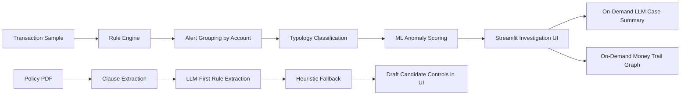

# AMLer

AMLer is a hybrid Anti-Money Laundering investigation system that combines rule-based detection, typology classification, anomaly scoring, on-demand LLM case summaries, policy PDF ingestion, and graph-based money trail visualization.

This project was built as a portfolio piece around a simple idea: AML tools should not just flag transactions, they should help an analyst understand why an account is suspicious, what pattern it resembles, and what to investigate next.

## STATUS 
currently working on the docker


_Here is the interactive architectural flow of AMLer._

## Current Evaluation Snapshot

Latest local evaluation run from `evaluate.py` on March 31, 2026 using `sample_size=1000`:

- Precision: `0.267`
- Recall: `0.990`
- F1 score: `0.420`
- True positives: `99`
- False positives: `272`
- Total alerts after filtering: `775`

What this means:

- The current system is tuned for very high recall, which is often the safer tradeoff in AML triage.
- Precision is still modest, which reflects the rule-heavy design and the cost of catching more suspicious behavior.
- The strongest false positives currently come from the structuring threshold rules, which gives me a clear next tuning target.


## Product Walkthrough

### Investigation Dashboard


_The main screen is designed for triage first: run the pipeline, review suspicious account counts, and move into detail only when needed._

### Account Detail View


_The account detail view brings together rule evidence, ML signals, an on-demand LLM case summary, and a PyVis money trail graph so one case can be reviewed end to end._

### Evaluation View


_The evaluation page makes the current precision/recall tradeoff explicit and shows which rules are driving false positives._

## What AMLer Does

AMLer supports two connected workflows:

1. Transaction investigation
- load a transaction sample
- run compliance rules
- group alerts by account
- assign a likely laundering typology
- rank suspicious accounts with Isolation Forest
- generate an AI case summary on demand
- visualize suspicious transfer paths as a graph

2. Policy ingestion
- read a text-based policy PDF
- split it into traceable policy clauses
- extract draft candidate rules with an LLM-first pipeline
- fall back to heuristic extractors when needed
- show candidate controls in the UI with source traceability

## Why I Built It This Way

Most AML demos stop at one of these layers:
- a rules engine
- a classifier
- a dashboard
- an LLM summary

AMLer intentionally combines serveral layers that are often shown separately:

- Rules are used for detection because they are interpretable and strong for recall.
- Typology logic is used to convert low-level alerts into higher-level laundering patterns.
- ML is used for prioritization, not as the primary source of truth.
- The LLM is used for explanation and policy interpretation, not as the decision-maker.
- Graph visualization is used in the detail view, where network structure is actually useful.

That separation of responsibilities is the main architectural idea behind the project.

## System Architecture



## Core Product Features

### 1. Rule-based AML detection
The backend loads policy rules from PostgreSQL and runs them against a transaction sample. The current rule families include:

- `THRESHOLD`
- `FORMAT`
- `FREQUENCY`
- `CHAIN`
- `BIPARTITE`

### 2. Account-level suspicious activity grouping
Alerts are grouped by account instead of being treated as isolated transactions. This makes the system better suited for investigation rather than simple transaction filtering.

### 3. Typology classification
Grouped alerts are mapped into laundering patterns such as:

- `STRUCTURING`
- `SMURFING`
- `LAYERING`
- `PLACEMENT`
- `UNKNOWN`

`UNKNOWN` is intentional. I did not want to force every suspicious account into a confident laundering label when the evidence was weak.

### 4. ML anomaly scoring
AMLer uses Isolation Forest to score suspicious accounts and prioritize which cases deserve analyst attention first.

The ML layer is used as a ranking layer, not as the core detection engine.

## Evaluation Interpretation

The current metrics tell an honest story about the system:

- AMLer is stronger at finding suspicious behavior than it is at filtering every false positive.
- That is intentional for this stage of the project because missing laundering activity is usually the more expensive failure.
- The evaluation output also gives a clear tuning path: threshold-based structuring rules currently dominate false positives.

This tradeoff is part of the project, not something hidden from it.

### 5. On-demand LLM case summaries
The detail page can generate an AI summary for a selected account. The LLM explains:

- likely risk level
- why the account appears suspicious
- what action an analyst should take next

This is done on demand instead of during the main `/analyze` request to keep the primary analysis flow fast.

### 6. Money trail graph visualization
The account detail page includes a PyVis graph that shows suspicious transfer paths for the selected account.

- nodes represent accounts
- edges represent aggregated suspicious transfer paths
- edge thickness reflects total suspicious amount

The graph is also generated on demand so the main analysis response stays lightweight.

### 7. Policy PDF ingestion
AMLer can ingest a text-based PDF policy document and turn it into:

- `PolicyClause` objects with page-level traceability
- draft candidate compliance rules

The current extraction strategy is:

- LLM-first structured extraction
- heuristic fallback for narrower patterns

Extracted rules are shown in the UI as `DRAFT` candidate controls and do not yet modify the live runtime detection flow.

## Important Design Decisions and Tradeoffs

| Decision | Why I chose it | Tradeoff |
| --- | --- | --- |
| Hybrid rules + typology + ML + LLM | AML is easier to explain when each layer has a clear role | More moving parts than a single-model system |
| `UNKNOWN` is a valid typology | Prevents forced and misleading labels | Some accounts remain less interpretable without deeper review |
| LLM summaries are on demand | Keeps `/analyze` fast and avoids unnecessary latency/cost | Requires an extra request in the detail flow |
| Account graph is on demand | Graph data is only useful in the investigation view | Requires rebuilding account graph context separately |
| Policy ingestion outputs draft controls only | Safer and more realistic than directly activating extracted rules | No full policy-to-runtime enforcement yet |
| LLM-first extraction with fallback heuristics | Better semantic flexibility without losing deterministic coverage | Adds validation and pipeline complexity |

## Tech Stack

- Backend: FastAPI
- Frontend: Streamlit
- Database: PostgreSQL
- ORM: SQLAlchemy
- Data processing: pandas
- ML: scikit-learn Isolation Forest
- LLM integration: OpenAI-compatible HTTP endpoint via `httpx`
- PDF parsing: `pypdf`
- Graph visualization: PyVis

## Repository Structure

```text
AMLer/
  api/                    # API schemas and refactor-in-progress backend modules
  compliance/             # Compliance runner and evaluator integration
  core/                   # Shared config and DB setup
  data/                   # Transaction data
  demo/                   # Product Demo
  evaluators/             # Rule family evaluators
  models/                 # Supporting dataclasses / ingestion models
  policy_extraction/      # LLM-first candidate rule extraction + heuristic fallback
  sample_pdf/             # Sample policy PDFs for ingestion demos
  ui/                     # Streamlit interface
  app.py                  # FastAPI entrypoint
  evaluate.py             # Evaluation script
  llm_layer.py            # LLM reasoning layer
  ml_layer.py             # Feature engineering and anomaly scoring
  policy_ingestion_service.py
  policy_rules_model.py   # SQLAlchemy rule models
  rule_seeder.py          # Seeds starter rules into the DB
  transaction_loader.py   # Loads transaction samples
  typology.py             # Account grouping and typology mapping
```

## How the Investigation Flow Works

### Main analysis flow
1. Load a transaction sample.
2. Load rules from PostgreSQL.
3. Run compliance checks.
4. Group suspicious activity by account.
5. Assign typology labels.
6. Score suspicious accounts with Isolation Forest.
7. Show ranked accounts in the Streamlit UI.
8. Let the user open one account for deeper investigation.
9. Generate an LLM case summary on demand.
10. Generate a money trail graph on demand.

### Policy ingestion flow
1. Load a text-based PDF.
2. Normalize and split the text into clauses.
3. Preserve page and heading context.
4. Ask the LLM whether a clause is an executable rule.
5. Validate structured output.
6. Fall back to heuristic extractors when the LLM does not return a safe rule.
7. Show candidate rules in the UI as reviewable drafts.

## Current API Surface

- `POST /analyze`
  - runs the main AML pipeline
- `POST /account-analysis`
  - generates an on-demand AI case summary for one selected account
- `POST /account-graph`
  - generates an on-demand graph payload for one selected account
- `GET /evaluate`
  - returns evaluation metrics against ground truth

## Running the Project Locally

### Prerequisites

- Python 3.11+
- PostgreSQL
- a local or remote OpenAI-compatible LLM endpoint for LLM features
  - for example LM Studio

### 1. Create and activate a virtual environment

```powershell
python -m venv .venv
.\.venv\Scripts\Activate.ps1
```

### 2. Install dependencies

```powershell
pip install -r requirements.txt
```

### 3. Configure environment variables

Use `.env.example` as the starting point for local config.

Expected variables:

- `DATABASE_URL`
- `SQL_ECHO`
- `LLM_BASE_URL`
- `LLM_MODEL`
- `LLM_TIMEOUT_SECONDS`
- `API_BASE_URL`
- `DEFAULT_SAMPLE_SIZE`

### 4. Initialize the database schema

```powershell
python inital.py
```

### 5. Seed starter rules

```powershell
python rule_seeder.py
```

### 5.5 Reproduce the evaluation snapshot

```powershell
python evaluate.py
```

### 6. Start the FastAPI backend

```powershell
uvicorn app:app --reload
```

### 7. Start the Streamlit UI

In a second terminal:

```powershell
streamlit run ui/interface.py
```

## Walkthrough

You can walkthrough the system :

1. Run analysis on a transaction sample.
2. Open the top suspicious account in `Account Detail`.
3. Generate the AI case summary.
4. Generate the money trail graph.
5. Open the `Policy Ingestion` page.
6. Upload a text-based PDF or use a bundled sample from `sample_pdf/`.
7. Show how clauses are turned into draft candidate controls.

## What This Project Demonstrates

AMLer is meant to show more than model training. It demonstrates:

- end-to-end backend and UI integration
- hybrid AI system design
- tradeoff-aware product decisions
- structured use of LLMs instead of LLM-overuse
- explainability in a regulated domain
- investigation-first UX design

## Current State

### Implemented

- end-to-end AML analysis pipeline
- account-level suspicious activity grouping
- typology classification
- ML ranking for suspicious accounts
- on-demand LLM account summaries
- on-demand money trail graph visualization
- policy PDF ingestion with draft rule extraction
- evaluation metrics and false-positive reporting

### In progress

- backend modularization and service-layer refactor
- Dockerization
- deployment polish

### Intentionally deferred

- activating extracted policy rules directly in runtime
- OCR support for scanned PDFs
- full production-grade approval workflow for extracted rules
- cloud deployment hardening

## Limitations

- LLM-backed features depend on an available OpenAI-compatible endpoint.
- Policy ingestion currently expects text-based PDFs rather than scanned documents.
- Extracted policy rules are review artifacts, not active runtime controls.
- Some backend orchestration still lives in `app.py` while the refactor is in progress.

## Key Technical Takeaways

If you are reviewing this project as a portfolio piece, the key technical story is:

- Rules handle interpretable suspicious activity detection.
- Typology maps raw alerts into recognizable laundering behavior.
- ML prioritizes the cases that deserve attention first.
- The LLM is used where it adds the most value: explanation and policy interpretation.
- The UI is designed around investigation depth, not just alert counts.

## Final Summary

AMLer is a multi-stage AML investigation system built to be explainable, interactive, and honest about tradeoffs. The project intentionally separates detection, prioritization, explanation, and policy interpretation so that each layer stays understandable and useful.

That design choice is the core of my project.
